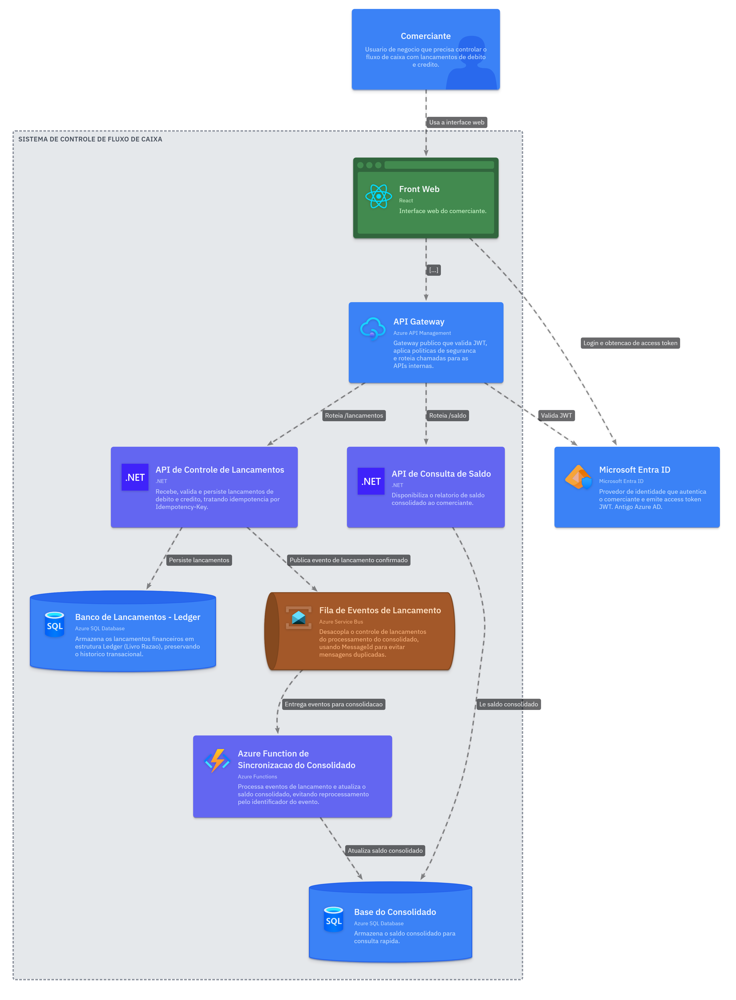
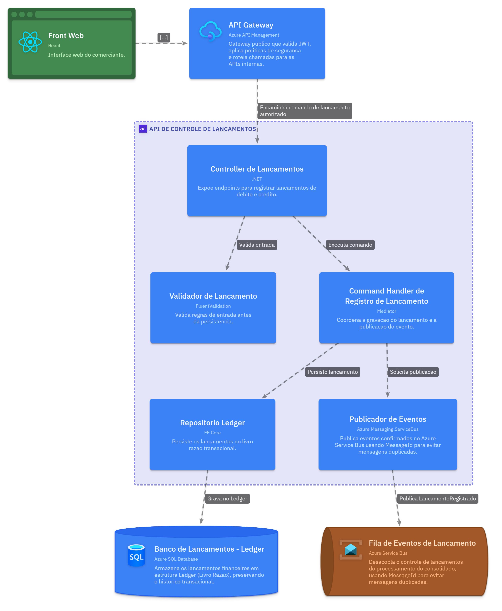
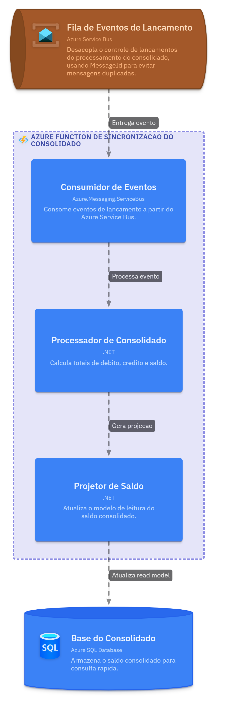
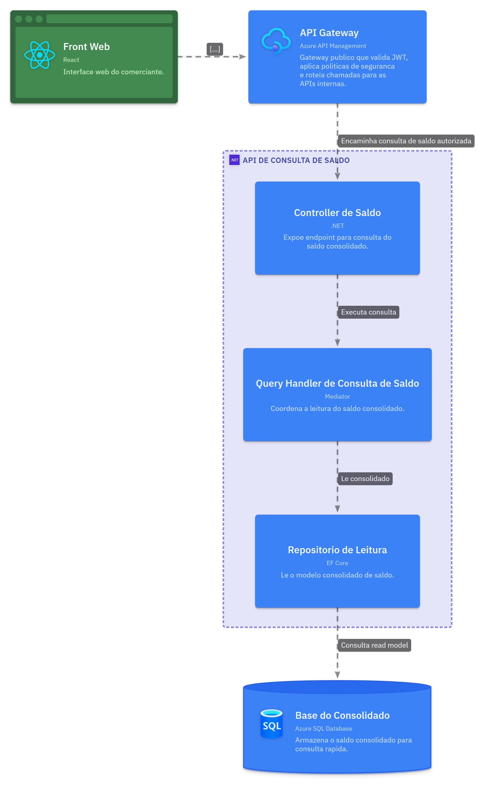

# Cash Flow

Solução .NET 10 para registro de lançamentos financeiros e consulta de saldo diário consolidado.

O **Ledger** recebe os lançamentos, garante idempotência e grava uma mensagem de integração (Outbox). A **Function** consome essa mensagem via Service Bus e atualiza o saldo no **Balance** usando o padrão Inbox.

## Arquitetura

O sistema é composto por Ledger API, Balance API, Azure Service Bus, Function de consolidação e bancos de dados independentes por contexto.

O registro do lançamento é síncrono. A consolidação do saldo é assíncrona, com consistência eventual.

### Visão geral (Containers)



### Ledger API (Componentes)



### Consolidação (Componentes)



### Balance API (Componentes)



Os diagramas são mantidos como código usando [LikeC4](https://likec4.dev) (Architecture as Code). As fontes estão em `docs/architecture`. Para exportar os PNGs:

```bash
npx likec4 export png docs/architecture --outdir docs/architecture/out/png --light
```

## Pré-requisitos

- .NET SDK 10
- Docker (para os containers)
- Azure Functions Core Tools (para executar a Function localmente)

## Execução local

```powershell
dotnet build CashFlow.sln
dotnet run --project src/01.Presentation/CashFlow.Ledger.Api
dotnet run --project src/01.Presentation/CashFlow.Balance.Api
```

Por padrão as APIs usam persistência em memória. As portas são definidas em `Properties/launchSettings.json` de cada API.

Swagger disponível em `/swagger` quando executado no ambiente `Development`.

Health check: `GET /health`.

## Quick Start com curl

Ajuste a porta conforme o `launchSettings.json` da API.

```powershell
# Crédito
curl.exe -X POST http://localhost:{porta}/v1/lancamentos `
  -H "Idempotency-Key: 11111111-1111-1111-1111-111111111111" `
  -H "Content-Type: application/json" `
  -d '{"comercianteId":"merchant-123","tipo":"credito","valor":150.00,"data":"2026-06-23","descricao":"Venda"}'

# Débito
curl.exe -X POST http://localhost:{porta}/v1/lancamentos `
  -H "Idempotency-Key: 22222222-2222-2222-2222-222222222222" `
  -H "Content-Type: application/json" `
  -d '{"comercianteId":"merchant-123","tipo":"debito","valor":50.00,"data":"2026-06-23","descricao":"Despesa"}'

# Listar lançamentos
curl.exe "http://localhost:{porta}/v1/lancamentos?comercianteId=merchant-123"

# Saldo consolidado (após a Function processar os eventos)
curl.exe "http://localhost:{porta-balance}/v1/saldo?comercianteId=merchant-123&data=2026-06-23"
```

## Docker

```powershell
docker build -f src/01.Presentation/CashFlow.Ledger.Api/Dockerfile -t cashflow-ledger-api .
docker run --rm -p 8081:8080 cashflow-ledger-api

docker build -f src/01.Presentation/CashFlow.Balance.Api/Dockerfile -t cashflow-balance-api .
docker run --rm -p 8082:8080 cashflow-balance-api
```

## Testes

```powershell
dotnet test CashFlow.sln
```
